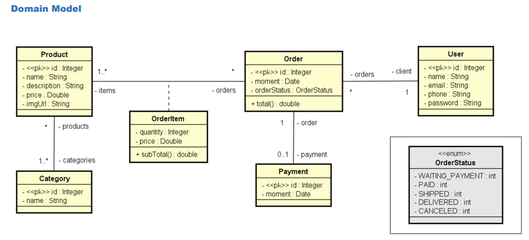
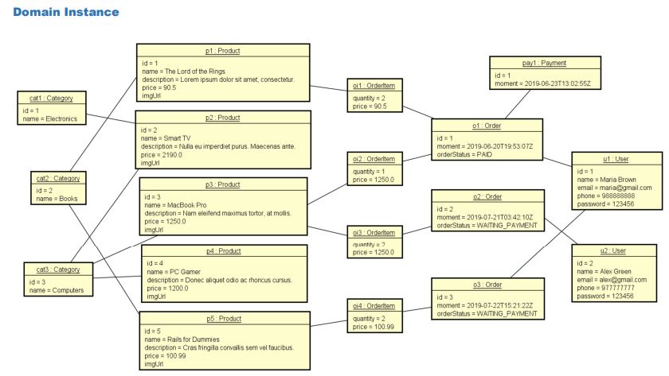
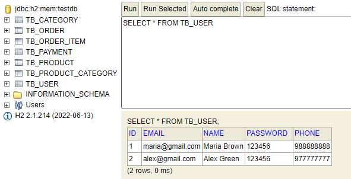

# spring-boot-web-services
Projeto web services com Spring Boot e JPA / Hibernate 

# Sobre o Projeto

Este projeto é uma implementação de uma API REST com Spring Boot e JPA / Hibernate. Ele implementa as operações CRUD (Create, Retrieve, Update, Delete) para as entidades Usuário, Pedido, Produto e Categoria.
O projeto também implementa autenticação JWT e tratamento de exceções.
Este projeto demonstra a construção de uma aplicação completa, com objetivos bem definidos:

## Objetivos
  - Criar um projeto Spring Boot em Java.
  - Implementar um modelo de domínio.
  - Estruturar as camadas lógicas: resource, service, repository.
  - Configurar um banco de dados de teste (H2).
  - Povoar o banco de dados.
  - Realizar operações CRUD - Create, Retrieve, Update, Delete.
  - Implementar tratamento de exceções.

# Diagrama de Classe

O Diagrama de Classe do projeto é composto pelas seguintes entidades:
  - User: representa um usuário da aplicação.
  - Orer: representa um pedido feito por um usuário.
  - Payment: representa o status do pagamento do pedido, utilizando o OrderStatus
  - Product: representa um produto vendido pela aplicação.
  - Category: representa uma categoria de produtos.
  - OrderItem: Vincula o Pedido, produto, preço e quantidade

## Instância do Domínio
  - Esta seção aborda a criação e manipulação de instâncias das classes de entidades do sistema, como "Usuário," "Pedido," "Categoria," "Produto," etc.

## Banco de Dados
  ### User
    
  

  - Orer: representa um pedido feito por um usuário.
  - Payment: representa o status do pagamento do pedido, utilizando o OrderStatus
  - Product: representa um produto vendido pela aplicação.
  - Category: representa uma categoria de produtos.
  - OrderItem: Vincula o Pedido, produto, preço e quantidade

