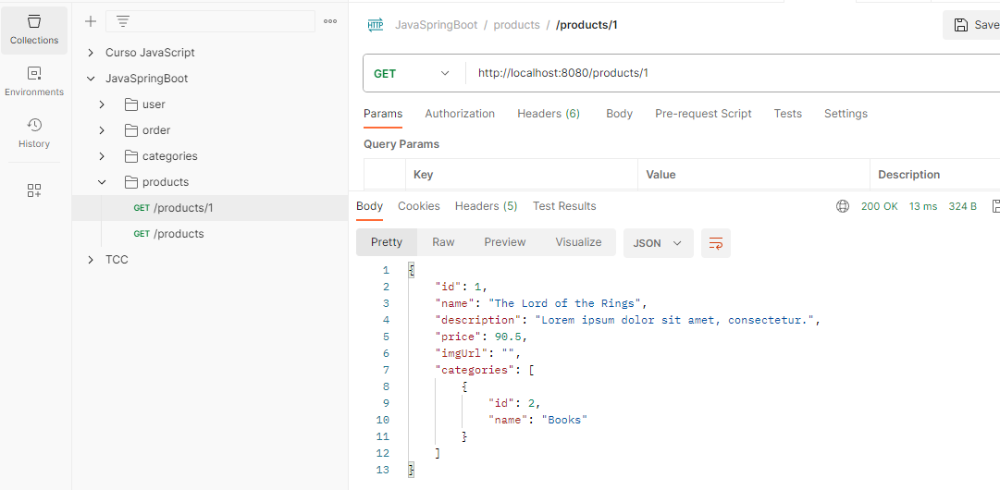

# spring-boot-web-services
Projeto web services com Spring Boot e JPA, Hibernate / Web services project with Spring Boot and JPA, Hibernate.

# Sobre o Projeto / About the Project

Este projeto é uma implementação de uma API REST com Spring Boot e JPA / Hibernate.
Ele implementa as operações CRUD (Create, Retrieve, Update, Delete) para as entidades Usuário, Pedido, Produto e Categoria.
O projeto também implementa autenticação JWT e tratamento de exceções.
Este projeto demonstra a construção de uma aplicação completa, com objetivos bem definidos:

This project is an implementation of a REST API using Spring Boot and JPA / Hibernate. It implements CRUD (Create, Retrieve, Update, Delete) operations for the entities User, Order, Product, and Category. The project also includes JWT authentication and exception handling. It demonstrates the construction of a complete application with well-defined objectives:

## Objetivos / Objectives
  - Criar um projeto Spring Boot em Java. / Create a Spring Boot project in Java.
  - Implementar um modelo de domínio. / Implement a domain model.
  - Estruturar as camadas lógicas: resource, service, repository. / Structure the logical layers: resource, service, repository.
  - Configurar um banco de dados de teste (H2). / Configure a test database (H2).
  - Povoar o banco de dados. / Populate the database.
  - Realizar operações CRUD - Create, Retrieve, Update, Delete. / Perform CRUD operations 
  - Implementar tratamento de exceções. / Implement exception handling.

# Tecnologias Utilizadas / Technologies Used
  - **Back end:** Spring Boot, JPA, Hibernate, PostgreSQL
  - **Front end:** Postman

# Diagrama de Classe / Class Diagram

O Diagrama de Classe do projeto é composto pelas seguintes entidades: / The project's Class Diagram consists of the following entities:
  - User: representa um usuário da aplicação. / Represents a user of the application.
  - Orer: representa um pedido feito por um usuário. / Represents an order placed by a user.
  - Payment: representa o status do pagamento do pedido, utilizando o OrderStatus / Represents the payment status of the order, using OrderStatus.
  - Product: representa um produto vendido pela aplicação. / Represents a product sold by the application.
  - Category: representa uma categoria de produtos. / Represents a product category.
  - OrderItem: Vincula o Pedido, produto, preço e quantidade / Links Order, product, price, and quantity.

## Instância do Domínio / 
  - Esta seção aborda a criação e manipulação de instâncias das classes de entidades do sistema, como "Usuário," "Pedido," "Categoria," "Produto," etc. / This section covers the creation and manipulation of instances of the system's entity classes, such as "User," "Order," "Category," "Product," etc.

## Banco de Dados / Domain Instance
  ### User    
  

  ### Orer
  
  
  ### Payment
  
  
  ### Product
  
  
  ### Category
  
  
  ### OrderItem
  

# Postman

### User

### Orer

### Product

### Category

# Autor
Bruno Cesar Serafim
[Linkedin](https://www.linkedin.com/in/bcserafim) - [Site Pessoal](http://bcserafim.infinityfreeapp.com/)
